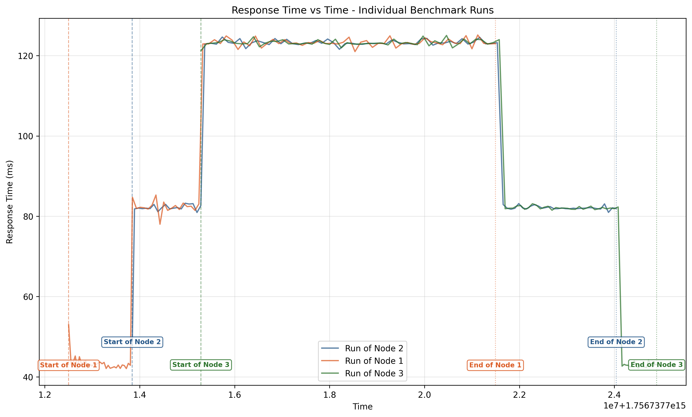
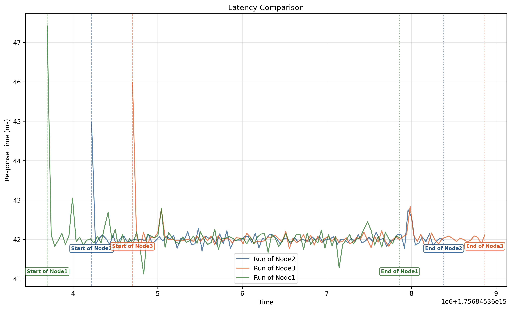

# Simple Tests
## First Try
First try, 100 sequential requests:
```erlang
(client@DORORO)1> test:bench(localhost, 8080).
Time Elapsed 174.338 ms
ok
```
We can serve up to **573 requests/s.**

Adding a 40ms processing delay we get:
```erlang
(client@DORORO)1> test:bench(localhost, 8080).
Time Elapsed 4408.464 ms
ok
```
The artificial delay radically increases the processing time, while the parsing overhead stays minimal.

## Multiple Clients at the same time
If we launch multiple clients at the same time and we run the bench function, saving the latency time of each request, we can see that it increases each time an new node starts to message the server as is it shown into this plot.



# Handling Concurrency


## Does it take a lot to create a process?
We can test how much time it takes to create a new process. The results are the following:

```bash
Average process creation time: 0.015 ms
Maximum process creation time: 0.171 ms
Minimum process creation time: 0.006 ms
```

Processes are very light to create, with very minimal overhead!

## Going Concurrent

We need to make ours server concurrent so it can handle multiple clients at the same time and increase the throughput.

Here it goes, Multi Rudy, using a connection pool he's capable of handling connections concurrently. Compared to the previous graph, here we can see how the latency doesn't increase when adding more clients.



# Questions to answer
- What happens when the servers are all full and an extra client connects?
- have we increased the throughput?
